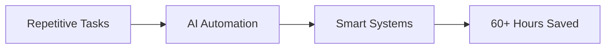
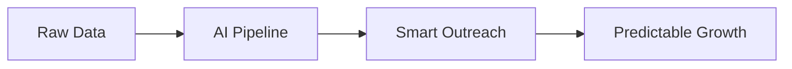

# <div align="center">👋 Building the Future with Code</div>

<div align="center">
  
### *"I don't just write code... I design systems that think, learn, and scale."*

[](https://git.io/typing-svg)

</div>

---

## 🚀 **Who Am I?**

```yaml
name: Noor Fatima
role: Software Engineering Student
focus: ["AI Systems", "Automation", "Product Development"]
philosophy: "Build > Talk | Systems > Shortcuts | Consistency > Motivation"
current_status: Building in public. Learning fast. Thinking long-term.
```

I'm a **builder, founder, and problem solver** who transforms ideas into real, working products — especially where **AI meets automation**. My mission is simple: create systems that **eliminate busywork** and **amplify human potential**.

---

## 🏢 **What I'm Building**

<table>
<tr>
<td width="50%">

### 🧠 **SixtyHours.tech**
**Software Solutions & AI Automation**



**Building systems that:**
- ⚡ Automate repetitive workflows
- 🎯 Reduce human effort drastically
- 📈 Increase efficiency using AI

**Goal:** Replace hours of work with intelligent systems.

</td>
<td width="50%">

### ⚙️ **Autometiq.com**
**Demand Engine for Modern Sales Teams**



**Designing a platform that:**
- 🎯 Scales outreach intelligently
- 📊 Optimizes sales pipelines
- 💰 Converts data into predictable revenue

**Goal:** Turn sales into a system, not guesswork.

</td>
</tr>
</table>

---

## 🛠️ **Tech Arsenal**

<div align="center">

### **Core Stack**


</div>

---

## 🧠 **Deep Focus Areas**

<table>
<tr>
<td align="center" width="33%">
  
### 🤖 **Machine Learning**
Building models that learn, adapt, and improve
  
</td>
<td align="center" width="33%">
  
### 📊 **Data Analysis**
Extracting insights that drive decisions
  
</td>
<td align="center" width="33%">
  
### 🧬 **Generative AI**
Creating AI that generates value, not just hype
  
</td>
</tr>
</table>

---

## 📊 **GitHub Analytics**

<div align="center">
  


</div>

<div align="center">
  
[](https://git.io/streak-stats)

</div>

---

## 🎯 **Current Mission**

```diff
+ Scaling SixtyHours.tech & Autometiq.com to serve thousands
+ Building AI systems that eliminate 60+ hours of manual work weekly
+ Shipping products that create measurable impact
+ Documenting the journey — building in public
```

---

## 💡 **Philosophy**

<div align="center">

| Principle | Meaning |
|-----------|---------|
| **Build > Talk** | Ship code, not opinions |
| **Systems > Shortcuts** | Sustainable solutions over quick fixes |
| **Consistency > Motivation** | Show up daily, regardless of mood |

</div>

---

## 🌐 **Let's Connect**

<div align="center">

[](https://github.com/Noor-Fatima2408)
[](https://linkedin.com/in/YOUR_LINKEDIN)
[](mailto:YOUR_EMAIL)
[](https://sixtyhours.tech)

</div>

---

<div align="center">

### ⚡ **"Building in public. Learning fast. Thinking long-term."**

**If you're working on something that matters, let's collaborate.**


</div>

---

<div align="center">
  
**⭐ Star my repos if you find value | 🔔 Follow for updates on my building journey**

*Last updated: April 2026*

</div>
