<!--
═══════════════════════════════════════════════════════════════════════════════
  NOOR FATIMA — GITHUB PROFILE README
  CRYPT palette (gothic — blood & bone)
    void #0b0b0e · sepulchre #0e0e13 · crypt #14141a · mortar #332a35
    bone #e8e3d9 · ash #7f7480
    blood #d94a5f · blood-deep #9b1b30 · candle #c9a227 · tallow #d9b64a
    nightshade #a487bd · verdigris #6faa96 · moss #93ae72

  SETUP
  1. Create a repo named exactly: noor202401938-netizen
  2. Drop this README.md at the repo root.
  3. Drop the whole assets/ folder next to it.
  4. Commit. GitHub renders it on your profile automatically.

  All SVGs are hand-built and self-contained — no external generators,
  no web fonts, no scripts. They render identically in GitHub's light
  and dark themes because they carry their own background.
═══════════════════════════════════════════════════════════════════════════════
-->


<br>

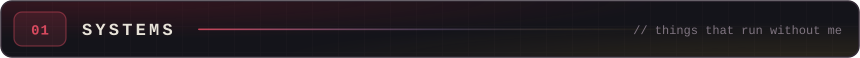

<table>
  <tr>
    <td width="50%" valign="top">
      <a href="https://sixtyhours.tech">
        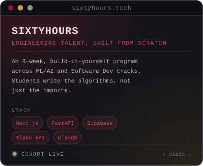
      </a>
    </td>
    <td width="50%" valign="top">
      <a href="https://autometiq.com">
        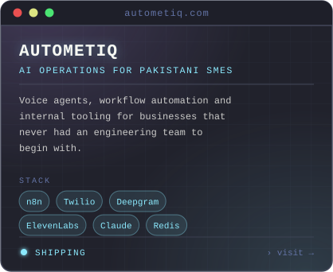
      </a>
    </td>
  </tr>
</table>

<br>

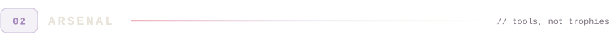

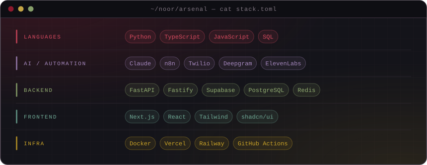

<br>

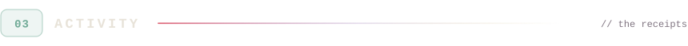

<table>
  <tr>
    <td width="58%">
      
    </td>
    <td width="42%">
      
    </td>
  </tr>
</table>


<br>


<!--
  ── PINNED REPO CARDS (disabled until you fill in real repo names) ───────────
  Uncomment the block below and replace REPO-NAME-1 / REPO-NAME-2 with actual
  repository names. The `repo=` value must match the repo name exactly, or the
  card renders as a broken image. Copy a <td> block to add more.

<table>
  <tr>
    <td width="50%">
      <a href="https://github.com/noor202401938-netizen/REPO-NAME-1">
        
      </a>
    </td>
    <td width="50%">
      <a href="https://github.com/noor202401938-netizen/REPO-NAME-2">
        
      </a>
    </td>
  </tr>
</table>
-->

```console
noor@github ~ $ ls -1 built/

  voice-agent-core/      # telephony + STT + LLM + TTS loop, sub-second turn-taking
  n8n-sme-workflows/     # reusable automation blueprints for non-technical teams
  sixtyhours-platform/   # cohort, submissions and mentor tooling
  retrieval-lab/         # BM25 + FAISS from scratch, no LangChain

noor@github ~ $ # replace the above with your real repos — one line, one truth
```

<br>

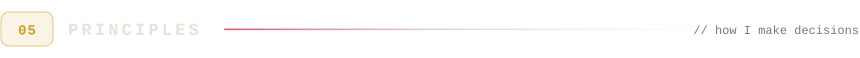

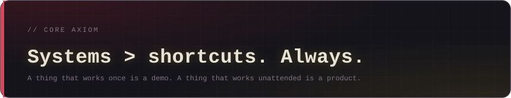 shortcuts. Always.">

```yaml
# ~/noor/principles.yml

build:
  - "Ship the ugly version that runs. Beauty is a refactor away; usage isn't."
  - "If it needs me awake to work, it isn't finished."
  - "Read the source before the tutorial."

teach:
  - "Write the algorithm before importing it. Once. Then import forever."
  - "A student who can explain it out loud has actually learned it."

business:
  - "Pakistani SMEs don't need AI. They need their Tuesday back."
  - "Automate the boring thing first — trust is earned on small wins."
```

<br>

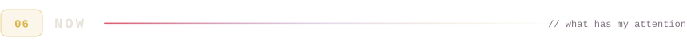

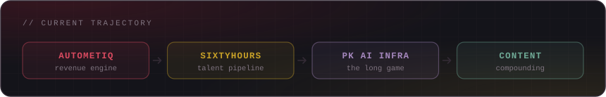

- **Autometiq** — voice agents and workflow automation in production for SME clients.
- **SixtyHours** — running the current cohort across the ML/AI and Software Dev tracks.
- **PK AI infrastructure** — the longer bet: local-context tooling that doesn't assume a US-shaped business.
- **Content** — writing up what actually works, so the next person skips a month.

<br>

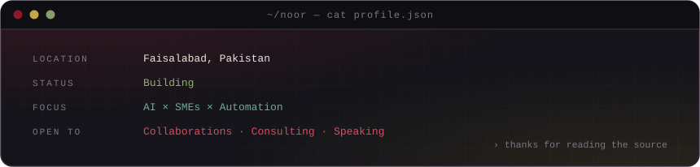

<p align="center">
  <a href="https://autometiq.com">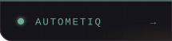</a>
  <a href="https://sixtyhours.tech">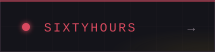</a>
  <a href="mailto:autometiq@gmail.com"></a>
  <!-- swap YOUR-HANDLE below for your LinkedIn slug -->
  <a href="https://www.linkedin.com/in/YOUR-HANDLE"></a>
</p>

<p align="center">
  <sub><code>CRYPT</code> · <code>#14141a</code> — no falling bats, no snake eating the contribution graph.</sub>
</p>
